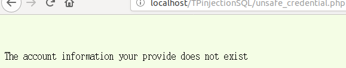
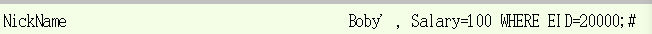
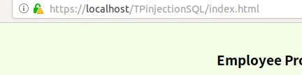

`Editor: Yuxin SHI 06/04/2018`
`[TD4]`
# Sécurité des systèmes d’information
## TD 4 : Sécuriser une application web

Les risques propres à une source de données sont les suivants :

-   vol de données (perte de confidentialité)
-   altération de données (perte d'intégrité)
-   destruction de données (remise en cause de la continuité d'activité)
-   augmentation du niveau de privilèges d'un utilisateur d'une application (sécurité, espionnage)
-   ressources systèmes abusives (déni de service)   


1. Identifier les vulnérabilités présentes dans l’application du TD3. Penser en priori-
tés aux :
(a) Injections SQL.

```php
# D'abord on modifie la méthode "GET" à "POST"
<form action="unsafe_credential.php" method="post"/>
<?php
   $input_eid = $_POST['EID'];
   $input_pwd = $_POST['Password'];
   $input_pwd = sha1($input_pwd);
?>

# Ensuite on modife SQL de playload en Prepared requêtte pour login
<?php
$statement = $conn->prepare("select id, name, eid, salary, birth, ssn, phoneNumber, address, email,nickname,Password
        FROM credential
        WHERE (eid=? and Password=?);");
 $statement->bind_param("ss", $input_eid, $input_pwd);

if (!$statement->execute()) {
    die('There was an error running the query [' . $conn->error . ']\n');
}

 $result=$statement->get_result();

/* convert the select return result into array type */
$return_arr = array();
while($row = $result->fetch_assoc()){
    array_push($return_arr,$row);
}
?>
```
L'effet de test pour login si on saisit "20000';#":


```php
# Pour l'injection de unsage_edit.php
<?php
    $statement = $conn->prepare("UPDATE credential SET (nickname=?,
     email=?,address=?,Password=?,PhoneNumber=?) where ID=$input_id;");
    $statement->bind_param("sssss", $input_nickname, $input_email, $input_address
                              $input_pwd, $input_phoneNumber);
    if (!$statement->execute()) {
       die('There was an error running the query [' . $conn->error . ']\n');
     }

   } else {
     $statement = $conn->prepare("UPDATE credential SET nickname=?,
       email=?,address=?, PhoneNumber=? where ID=$input_id;");
       $statement->bind_param("ssss", $input_nickname, $input_email, $input_address
                                 $input_phoneNumber);
      if (!$statement->execute()) {
          die('There was an error running the query [' . $conn->error . ']\n');
        }

   }
?>
```
Si on veut faire l'injection par UPDATE:


(b) Droits d’accès au niveau de la BD.
Limiter les permissions des utilisateurs permet de diminuer le dommage du vol de données, si on a plusieur base de données, une fois les attakeurs ont l'accès au base de données courante, ils ne peuvent pas voler les données des autres bds.   
Dans ce cas là, on va créer un utilisateur qui ne peut que visiter la BD Users, on peut aussi configurer les adresses IP acceptées, mais vous n'avez pas demandé.
```sql
CREATE USER 'adminusers'@'localhost' IDENTIFIED BY 'mdp';
GRANT SELECT, UPDATE ON Users TO 'adminusers'@'localhost';
```
(c) Mots de passes :
si les mots de passes sont bien protegés, l'encodage deuxième fois, ça permet de protéger les clients et les employées. Si une entreprise a perdu les données de client, sa réputation serait totalement cassée. Encoder les mdp ne suffissent pas, parce que les attakeurs peuvent capturer les flux de réseaux pour voler les données, il faut encoder les données du réseaux aussi. Par contre, si les attakeurs sont assez forts pour construire un attack intermediaire, l'entreprise est encore dans la merde.
i. Stockage dans la BD.
Après la recherche, il y a deux moyens à amélioler le stockage dans la BD:
- soit on change le codage de php de sha1 à sha512, ou en utilisant le module bcrypt
- soit on change le codage au niveau de BD, mysql propose aussi des solutions pour sauvegarder les mdps. Par exemple: aes. Selon les tables que vous proposez, on voit qu'il y a une table **secret**, c'est bien la solution **aes**.
Pour implémenter aes, il fallait changer ça au niveau de code PHP, mais je n'aime pas php, je ne fais pas:
```sql
# Pour insérer les données:
INSERT INTO `users` (`email`, `pswd`) VALUES ('user6@example.com', AES_ENCRYPT('pass123', 'secret'));
# Pour selectionner:
SELECT AES_DECRYPT(`Password`, 'secret') AS `Password` FROM `credential` WHERE id = $input_id;
# Pour mise à jour:
UPDATE credential SET Password = AES_ENCRYPT(?, 'secret') WHERE id = $input_id;
```

ii. Mode de transmission entre le client et le serveur.
- D'abord, on active le module ssl, par cmd: **a2enmod ssl**
- On active le site : **a2ensite default-ssl**
- On recharge le service apache: service apache2 restart
- On visite le site en ajoutant dans la liste de configance
L'effet:    
   

Pour faire redirection de http ==> https
- Activer le module rewrite
- Ajouter la configuration dans **apache2.conf** :
```xml
<VirtualHost *:80>
 ServerName 127.0.0.1
 DocumentRoot /var/www/html
 RewriteEngine on
 RewriteRule ^ https://%{SERVER_NAME}%{REQUEST_URI} [END,QSA,R=permanent]
 </VirtualHost>
```
- Recharger le service   

Ça fonctionne pour moi. Mais je ne peut pas mettre un vidéo là.
