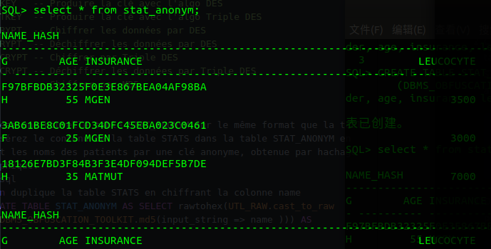
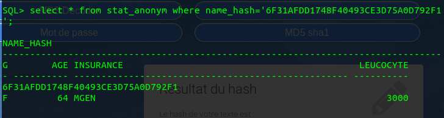
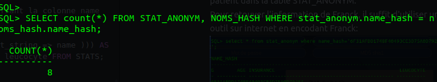
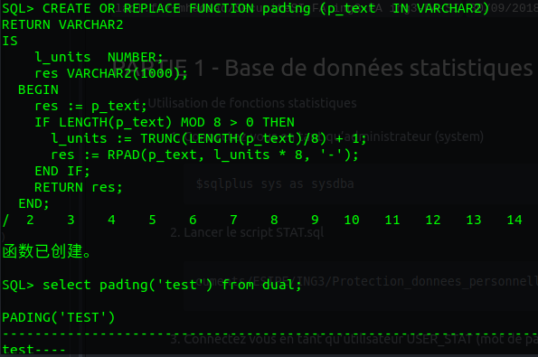
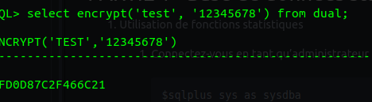
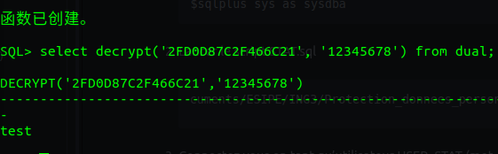

# Sécurité des systèmes d’information TD1
`lacl.fr/~mhaddad/SecuriteSI-FA   ing3-FA ing3-FA-SI`
`30/09/2018 [ing3 SSI][TP1]`
## PARTIE 1 - Base de données statistiques

1. Utilisation de fonctions statistiques
  1. Connectez-vous en tant qu’administrateur (system)
    ```
    $sqlplus sys as sysdba
    ```
  2. Lancer le script STAT.sql
    ```
    SQL> @/home/teasyu/Documents/ESIPE/ING3/Protection_donnees_personnelles/tp1/STAT.sql
    ```

  3. Connectez vous en tant qu’utilisateur USER_STAT (mot de passe : oracle)
    ```
    $sqlplus user_stat
    ```
    
  4. Cet utilisateur a-t-il accès à la table STATS et à la vue STATS_VIEW ?
  ```  
  Non, cet utilisateur n'a pas d'accès a la table STATS ni la vue STATS_VIEW.
  ```
  5. SELECT proprié-taire_fonction.nom_fonction (contenu_clause_where) from dual ;
  ```sql
  SELECT OWNER FROM ALL_OBJECTS where object_name='WHERE_CLAUSE';
  SELECT OWNER FROM ALL_OBJECTS where object_name='ROW_COUNT';
  SELECT OWNER FROM ALL_OBJECTS where object_name='SUM_LEUCOCYTE';
  OWNER
    ------------------------------
  SYS
  SELECT SYS.ROW_COUNT('insurance="MATMUT"') from dual;
  ```

  6. Quel est le nombre de patients assurés à la MATMUT, et la somme de leur taux de leucocyte ?

    ```sql
    SQL> SELECT SYS.ROW_COUNT('insurance=''MATMUT''') from dual;
    SYS.ROW_COUNT('INSURANCE=''MATMUT''')
      -------------------------------------
				    4
    SELECT SYS.SUM_LEUCOCYTE('insurance=''MATMUT''') from dual;
    SYS.SUM_LEUCOCYTE('INSURANCE=''MATMUT''')
    - ----------------------------------------
				    20000
    ```
  7. Quel est le nombre total de patients dans la base ?

    ```sql
    SQL> SELECT SYS.ROW_COUNT('gender=''H''') from dual;
    SYS.ROW_COUNT('GENDER=''H''')
      -----------------------------
  			    6
    SQL> SELECT SYS.ROW_COUNT('gender=''F''') from dual;
    SYS.ROW_COUNT('GENDER=''F''')
      -----------------------------
  			    4
    ```

2. Attaque de fonctions statistiques non protégées
  1.  Utiliser les fonctions statistiques pour obtenir le taux de leucocyte de Dubois.   
  On peut directement interroger les donnees..
    ```sql
      SELECT SYS.ROW_COUNT('insurance=''MGEN'' AND gender=''H''') from dual; ==>1
      SELECT SYS.SUM_LEUCOCYTE('insurance=''MGEN'' AND gender=''H''')from dual; ==>3500
    ```
3. Attaque de fonctions statistiques protégées
  1. Connectez-vous en tant qu’administrateur.Lancer le script STAT_PROTECT_1.sql. Connectez-vous en tant qu’utilisateur USER_STAT.Relancer l’attaque conduite à la section précédente. Fonctionne-t-elle toujours ?
  ```sql
  SQL>sqlplus sys as sysdba
  SQL>sqlplus USER_STAT as sysdba
  SQL>@/home/teasyu/Documents/ESIPE/ING3/Protection_donnees_personnelles/tp1/STAT_PROTECT_1.sql
  SQL>SELECT SYS.SUM_LEUCOCYTE('insurance=''MGEN'' AND gender=''H''')from dual;
  # Il y a rien
  SYS.SUM_LEUCOCYTE('INSURANCE=''MGEN''ANDGENDER=''H''')
    -----------------------------------------------------
  ```
  2. Trouver une séquence d’appels aux fonctions statistiques protégées permettant d’obtenir quand même le taux de leucocyte de Dubois.   
  On sait qu'il y a 6 patients masculin en total, et il y a qu'un patient qui utilise MGEN et masculin  quand le systeme retourne null dans la question3.1, on interroge le leucocyte en total des hommes, et on interroge la somme du leucocyte des hommes qui n'utilisent pas MGEN.

    ```sql
  SELECT SYS.SUM_LEUCOCYTE('gender=''H''') from dual;==> 25300
  SELECT SYS.SUM_LEUCOCYTE('insurance!=''MGEN'' AND gender=''H''') from dual; ==>21800
  SQL> select 25300-21800 from dual;
  25300-21800
    -----------
       3500
    ```
4. Attaques de fonctions statistiques protégées
  1. Connectez-vous en tant qu’administrateur.Lancer le script STAT_PROTECT_1.sql. Connectez-vous en tant qu’utilisateur USER_STAT.Relancer l’attaque conduite à la section précédente. Fonctionne-t-elle toujours ?
  ```sql
  SQL>sqlplus sys as sysdba
  SQL>sqlplus USER_STAT as sysdba
  SQL>@/home/teasyu/Documents/ESIPE/ING3/Protection_donnees_personnelles/tp1/STAT_PROTECT_2.sql
  SELECT SYS.SUM_LEUCOCYTE('gender=''H''') from dual;==> 25300
  SELECT SYS.SUM_LEUCOCYTE('insurance!=''MGEN'' AND gender=''H''') from dual; ==>21800
    -----------------------------------------------------
  ```

  ## PARTIE 2 - Anonymat et Chiffrement (package Oracle de chiffrement)
  Dans cette partie, nous utiliserons le package DBMS_OBFUSCATION_TOOLKIT.
  1. Pseudonymat par hachage
    1. interrogez Oracle XE pour connaitre la liste des fonctions cryptographique disponibles dans le package de chiffrement.    
    Je n'ai pas trouvé la commande pour interroger Oracle, mais on peut savoir les types de chiffrement à l'aide de documentation.
    ```
   DESGETKEY   -- Produire la clé avec l'algo DES
   DES3GETKEY  -- Produire la clé avec l'algo Triple DES
   DESENCRYPT  -- Chiffrer les données par DES
   DESDECRYPT  -- Déchiffrer les données par DES
   DES3ENCRYPT -- Chiffrer par Triple DES
   DES3DECRYPT -- Déchiffrer les données par Triple DES
   MD5         -- Chiffrer par MD5
    ```

    2. Créez une nouvelle table STAT_ANONYM sur le même format que la table
STATS. Insérez le contenu de la table STATS dans la table STAT_ANONYM en remplaçant les noms des patients par une clé anonyme, obtenue par hachage cryptographique.
      ```sql
      # On duplique la table STATS en chiffrant la colonne name
      CREATE TABLE STAT_ANONYM AS SELECT rawtohex(UTL_RAW.cast_to_raw
        (DBMS_OBFUSCATION_TOOLKIT.md5(input_string => name ))) AS name_hash, gender, insurance, age, leucocyte FROM STATS;
    ```

    1. Donnez les droits nécessaires à l’utilisateur USER_STAT pour qu’il puisse accéder à la table STAT_ANONYM.
    ```sql
    GRANT SELECT ON STAT_ANONYM TO USER_STAT;
    ```
    
  2. Attaque au pseudonymat par hachage
    1. En supposant que cet utilisateur connaisse le nom d’un patient (par exemple le patient ’franck’), retrouvez toutes les données (age, genre, leucocyte) correspondant à ce patient dans la table STAT_ANONYM.   
    Pour retouver l'information de Franck, il suffit d'utiliser un outil sur internet en encodant Franck:
       

    2. Retrouvez dans la table STAT_ANONYM chaque ligne correspondant à un
nom de la table NOMS. Combien de lignes de la table STAT_ANONYM parvenez-vous  a de-anonymiser ?   
    Ici je n'ai pas bien compris la question, a mon avis, hackers peuvent creer une table comme une dictionaire qui contient les noms des patients, en utilisant la function "DBMS_OBFUSCATION_TOOLKIT.md5", ils convertissent les noms en format md5, et faire une jointure avec la table origine pour avoir l'information sensitive qui correspondant aux individus.
    ```sql
    CREATE TABLE NOMS_HASH AS SELECT rawtohex(UTL_RAW.cast_to_raw
      (DBMS_OBFUSCATION_TOOLKIT.md5(input_string => name ))) AS name_hash FROM NOMS;
      SELECT count(*) FROM STAT_ANONYM, NOMS_HASH WHERE stat_anonym.name_hash = noms_hash.name_hash;
    ```
       

  3. Pseudonymat par chiffrement
    1. Connectez-vous en tant qu’administrateur.Créez une table CLEF avec un champs VAL de type CHAR(8) dans laquelle vous stockerez une clé (secrète) que vous choisirez.
    ```sql
    CREATE TABLE CLEF (val char(8));
    INSERT INTO CLEF VALUES('qwertyui');
    ```
    2. Le script CRYPT.sql crée les fonctions ENCRYPT et DECRYPT que vous
pourrez utiliser. Compléter le script (chaque série de points d’interrogation est à remplacer par un nom de variable).    
    En modifiant les fonctions de CRYPT.sql comme ci-dessous, on peut encrypter les donnees et les decrypter.    
    La fonction *pading* permet de calculer la longueur de string encrypte. La fonction *encrypt* permet de encrypter une chaine de caractere avec pading, la variabe *text* est les donnees qu'il est encryptees, key peut etre une chaine de caractere de taille 8 aleatoires. La fonction *decrypt* permet de decrypter une chaine de caractere et calculer le padding.   

    ```sql
    CREATE OR REPLACE FUNCTION pading (p_text  IN VARCHAR2)
    RETURN VARCHAR2
    IS
        l_units  NUMBER;
        res VARCHAR2(1000);
      BEGIN
        res := p_text;
        IF LENGTH(p_text) MOD 8 > 0 THEN
          l_units := TRUNC(LENGTH(p_text)/8) + 1;
          res := RPAD(p_text, l_units * 8, '-');
        END IF;
        RETURN res;
      END;
    /

    select pading('test') from dual;

    CREATE OR REPLACE FUNCTION encrypt (text  IN VARCHAR2, key IN VARCHAR2)
    RETURN VARCHAR2
    IS
        pad VARCHAR2(1000);
        res VARCHAR2(1000);
      BEGIN
      pad := pading(text);
      res := DBMS_OBFUSCATION_TOOLKIT.desencrypt(
              input => UTL_RAW.cast_to_raw(pad),
              key  => UTL_RAW.cast_to_raw(key) );
      RETURN res;
      END;
    /
    CREATE OR REPLACE FUNCTION decrypt (text  IN VARCHAR2, key IN VARCHAR2)
    RETURN VARCHAR2
    IS
      dec VARCHAR2(1000);
      res VARCHAR2(1000);
    BEGIN
      dec := UTL_RAW.CAST_TO_VARCHAR2(
              DBMS_OBFUSCATION_TOOLKIT.desdecrypt(
               input => text,
               key   => UTL_RAW.cast_to_raw(key) ) );
      res := RTrim(dec, '-');
      RETURN res;
    END;
    /
    ```
    
    
    

  1. Insérez le contenu de la table STATS dans la table STAT_ANONYM2 en remplaçant les noms des patients par une valeur anonyme obtenue par chiffrement du nom avec votre clé secrète.
    Je n'ai pas trouvé le syntax qui permet de creer une table par les fonctionnes, donc j'utilise une methode stupide pour creer STAT_ANONYM2.
    ```sql
      create table STAT_ANONYM2 (name varchar(50), gender char(1), age NUMBER, insurance varchar(50), leucocyte NUMBER);

      insert into STAT_ANONYM2 values('9EE93891AD3B4897', 'H', 55, 'MGEN', 3500);
      insert into STAT_ANONYM2 values('EDFB0BD9C956B6BA', 'F', 25, 'MGEN', 3000);
      insert into STAT_ANONYM2 values('4F55228DE9637407', 'H', 35, 'MATMUT', 7000);
      insert into STAT_ANONYM2 values('ED80F997AF51FE2A', 'F', 45, 'MATMUT', 5500);
      insert into STAT_ANONYM2 values('9DB52752C0419A5B', 'H', 65, 'MAIF', 2800);
      insert into STAT_ANONYM2 values('F064A0332DB62F3F', 'F', 55, 'MGEN', 3200);
      insert into STAT_ANONYM2 values('008D3B8A2D0AA701', 'H', 55, 'MATMUT', 5000);
      insert into STAT_ANONYM2 values('45ACDB02B4DD9A6C', 'H', 55, 'MATMUT', 2500);
      insert into STAT_ANONYM2 values('DDC9EC9D600D12C8', 'F', 64, 'MGEN', 3000);
      insert into STAT_ANONYM2 values('CBD23FF04D823B65', 'H', 57, 'MAIF', 4500);

      GRANT SELECT ON STAT_ANONYM2 TO USER_STAT;
    ```
4. Attaque au pseudonymat par chiffrement
  1. Connectez-vous en tant qu’utilisateur USER_STAT. En supposant que cet utilisateur connaisse le nom d’un patient comme précédemment, peut-il retrouver les données correspondant à ce patient dans la table STAT_ANONYM2?   
  >Non, USER_STAT n'a pas d'acces a la cle, il ne peut pas retrouver les données correspondant a ce patient dans la table STAT_ANONYM2.   

  2. Lancer le script LISTING.sql. Une table LISTING contenant une série de noms potentiels avec leur genre,age, et compagnie d’assurance, vous est fournie dans le script LISTING.sql.Dé-anonymiser la table STAT_ANONYM en utilisant LISTING.sql. Combien de lignes de la table STAT_ANONYM parvenez-vous à dé-anonymiser ?   
  > C'est une question identique avec la question 2. Il suffit de comparer le genre, assurance, age etc.

5. 2-Anonymat
  1. Connectez-vous en tant qu’administrateur. Anonymiser (à la main) la table STAT_ANONYM2 de manière à la rendre 2-anonyme.
  > On peut classifier les champs en 2 types{name, les restes}, mais je n'ai pas trouve les commandes qui permettent de creer 2-anonyme, il y a que la creation de synonime sur oracle doc.
