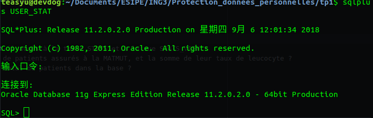

# Sécurité des systèmes d’information TD1

## PARTIE 1 - Base de données statistiques

1. Utilisation de fonctions statistiques
  1. Connectez-vous en tant qu’administrateur (system)
    ```
    $sqlplus sys as sysdba
    ```
  2. Lancer le script STAT.sql
    ```
    SQL> @/home/teasyu/Documents/ESIPE/ING3/Protection_donnees_personnelles/tp1/STAT.sql
    ```

  3. Connectez vous en tant qu’utilisateur USER_STAT (mot de passe : oracle)
    ```
    $sqlplus user_stat
    ```
    
  4. Cet utilisateur a-t-il accès à la table STATS et à la vue STATS_VIEW ?
  ```  
  Non, cet utilisateur n'a pas d'accès a la table STATS ni la vue STATS_VIEW.
  ```
  5. SELECT proprié-taire_fonction.nom_fonction (contenu_clause_where) from dual ;
  ```sql
  SELECT OWNER FROM ALL_OBJECTS where object_name='WHERE_CLAUSE';
  SELECT OWNER FROM ALL_OBJECTS where object_name='ROW_COUNT';
  SELECT OWNER FROM ALL_OBJECTS where object_name='SUM_LEUCOCYTE';
  OWNER
    ------------------------------
  SYS
  SELECT SYS.ROW_COUNT('insurance="MATMUT"') from dual;
  ```

  6. Quel est le nombre de patients assurés à la MATMUT, et la somme de leur taux de leucocyte ?

    ```sql
    SQL> SELECT SYS.ROW_COUNT('insurance=''MATMUT''') from dual;
    SYS.ROW_COUNT('INSURANCE=''MATMUT''')
      -------------------------------------
				    4
    SELECT SYS.SUM_LEUCOCYTE('insurance=''MATMUT''') from dual;
    SYS.SUM_LEUCOCYTE('INSURANCE=''MATMUT''')
    - ----------------------------------------
				    20000
    ```
  7. Quel est le nombre total de patients dans la base ?

    ```sql
    SQL> SELECT SYS.ROW_COUNT('gender=''H''') from dual;
    SYS.ROW_COUNT('GENDER=''H''')
      -----------------------------
  			    6
    SQL> SELECT SYS.ROW_COUNT('gender=''F''') from dual;
    SYS.ROW_COUNT('GENDER=''F''')
      -----------------------------
  			    4
    ```

2. Attaque de fonctions statistiques non protégées
  1.  Utiliser les fonctions statistiques pour obtenir le taux de leucocyte de Dubois.   
  On peut directement interroger les donnees..
    ```sql
      SELECT SYS.ROW_COUNT('insurance=''MGEN'' AND gender=''H''') from dual; ==>1
      SELECT SYS.SUM_LEUCOCYTE('insurance=''MGEN'' AND gender=''H''')from dual; ==>3500
    ```
3. Attaque de fonctions statistiques protégées
  1. Connectez-vous en tant qu’administrateur.Lancer le script STAT_PROTECT_1.sql. Connectez-vous en tant qu’utilisateur USER_STAT.Relancer l’attaque conduite à la section précédente. Fonctionne-t-elle toujours ?
  ```sql
  SQL>sqlplus sys as sysdba
  SQL>sqlplus USER_STAT as sysdba
  SQL>@/home/teasyu/Documents/ESIPE/ING3/Protection_donnees_personnelles/tp1/STAT_PROTECT_1.sql
  SQL>SELECT SYS.SUM_LEUCOCYTE('insurance=''MGEN'' AND gender=''H''')from dual;
  # Il y a rien
  SYS.SUM_LEUCOCYTE('INSURANCE=''MGEN''ANDGENDER=''H''')
    -----------------------------------------------------
  ```
  2. Trouver une séquence d’appels aux fonctions statistiques protégées permettant d’obtenir quand même le taux de leucocyte de Dubois.   
  On sait qu'il y a 6 patients masculin en total, et il y a qu'un patient qui utilise MGEN et masculin  quand le systeme retourne null dans la question3.1, on interroge le leucocyte en total des hommes, et on interroge la somme du leucocyte des hommes qui n'utilisent pas MGEN.

    ```sql
  SELECT SYS.SUM_LEUCOCYTE('gender=''H''') from dual;==> 25300
  SELECT SYS.SUM_LEUCOCYTE('insurance!=''MGEN'' AND gender=''H''') from dual; ==>21800
  SQL> select 25300-21800 from dual;
  25300-21800
    -----------
       3500
    ```
4. Attaques de fonctions statistiques protégées
  1. Connectez-vous en tant qu’administrateur.Lancer le script STAT_PROTECT_1.sql. Connectez-vous en tant qu’utilisateur USER_STAT.Relancer l’attaque conduite à la section précédente. Fonctionne-t-elle toujours ?
  ```sql
  SQL>sqlplus sys as sysdba
  SQL>sqlplus USER_STAT as sysdba
  SQL>@/home/teasyu/Documents/ESIPE/ING3/Protection_donnees_personnelles/tp1/STAT_PROTECT_2.sql
  SELECT SYS.SUM_LEUCOCYTE('gender=''H''') from dual;==> 25300
  SELECT SYS.SUM_LEUCOCYTE('insurance!=''MGEN'' AND gender=''H''') from dual; ==>21800
    -----------------------------------------------------
  ```
