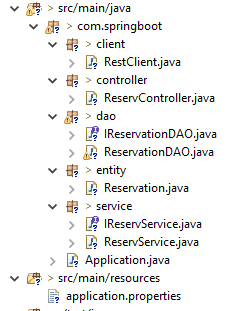
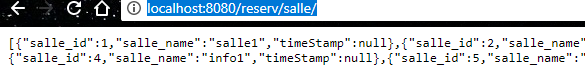

`Editor: Yuxin SHI`
`SI 2 FISE`
# Compte rendue : Outils pour cycle de vie Logiciel
## TP3
1. Implémenter une deuxième fonctionnalité de votre choix pour l’utilisateur enseignant, en se basant sur le principe de multi-module vue dans le cours (vous êtes libre dans le choix de l’implémentation de cette fonctionnalité, vous pouvez utiliser ce que vous voulez comme librairie).
Le projet est sur github:   
<a href="https://github.com/yuxinShi02/springbootExemple/tree/master/spring-boot-try">Click github yuxin </a>  
Ceci la structure du projet:<br/>
 <br/>
J'ai implementé une nouvelle fonctionnalité : consulter les salles, ainsi sa disponibilité.
Par exemple:
  - Si on veut savoir que la salle id 1 est disponible ou pas à 2017/10/24: 2017/10/24:
  http://localhost:8080/reserv/salle/1/2017-10-24
  Le résultat:
  
  - Si on veut consulter tous les salles:
  http://localhost:8080/reserv/salle/
  Le résultat:
  
2. Centraliser les informations, factoriser les dépendances de votre projet (utiliser le principe des propriétés).   
`jai pas compris`
3. Configurer maven afin de pouvoir utiliser ce référentiel central : http://repo.maven.apache.org/maven2/.
Dans le fichier config de maven: `setting.xml`, on change les parametres:
```xml
<repositories>
     <repository>
       <id>central</id>
       <url>https://repo.maven.org/maven2</url>
       <releases>
         <enabled>true</enabled>
       </releases>
     </repository>
   </repositories>
   <pluginRepositories>
     <pluginRepository>
       <id>central</id>
       <url>https://repo.maven.org/maven2</url>
       <releases>
         <enabled>true</enabled>
       </releases>
     </pluginRepository>
   </pluginRepositories>
```
4. Installer Archiva sur votre machine (idéalement sur une VM accessible en réseau depuis votre machine), configurer maven pour utiliser ce référentiel distant.
Il y a deux moyens a utiliser Archiva, soit on l'utilise comme un repository privé principal, soit on l'utilise comme un repository dans les listes de repositories. Ici on ajoute rien dans Archiva donc on va utiliser deuxième méthode.
Après l'installation d'Archiva et la création d'admin. On ajoute un profile dans setting.xml:
```xml
<profile>
	<id>Archiva Repo</id>
	<activation>
		<activeByDefault>true</activeByDefault>
	</activation>
	<repositories>
		<repository>
			<id>archiva.internal</id>
			<url>http://localhost:8022/repository/internal/</url>
			<releases>
			        <enabled>true</enabled>
			</releases>
			<snapshots>
				<enabled>true</enabled>
			 </snapshots>
		<repository>
	</repositories>
</profile>

```
Ces messages sont disponible dans http://localhost:8022/#repositorylist.


5. Implémenter des tests unitaires couvrant certaines méthodes proposées par l’API JUnit et Jmockit.
Dans mon projet, j'ai ajouté un package: test, ainsi les deux classes qui permet d'effectuer les tests unitaires.
Test de reservationById:
```java
/**
 * Compare the result of web and the result of database
 * if they are equal, test is true
 */
@Test
public void testReservById(){
  System.out.println("test ReservByID");
  RestClient restClient = new RestClient();
  String stringByWeb = restClient.getByIdReserv(1);

  ReservationDAO reservationDAO = new ReservationDAO();
  Reservation rsvByDao = reservationDAO.getById(1);
  assertEquals(stringByWeb, rsvByDao.toString());
}
```
Ceci testrunner:
```java
public class TestRunner {
	 public static void main(String[] args) {
	      Result result = JUnitCore.runClasses(TestSample.class);
	      for (Failure failure : result.getFailures()) {
	         System.out.println(failure.toString());
	      }
	      System.out.println(result.wasSuccessful());
	   }
}
```

6. Exécuter en mode commande les tests unitaires et vérifier que ça passe sans échec.   
Malheusement,
J'ai bien ajouté jUnit.jar dans maven projet, et je n'ai pas pu résodre ce probleme.

Après de recharger le projet, j'ai fait override de junit de Springboot, cette fois ci, jUnit est bien ajoute dans le projet.

Ceci le résultat:


SI on veut upload les artificts du projet sur le repo privé, on peut configurer le fichier pom.xml du projet en ajoutant:
```xml
<distributionManagement>
  <repository>
    <id>archiva.internal</id>
    <name>Archiva Repo</name>
    <url>http://localhost:8022/repository/internal/</url>
  </repository>
</distributionManagement>
```
