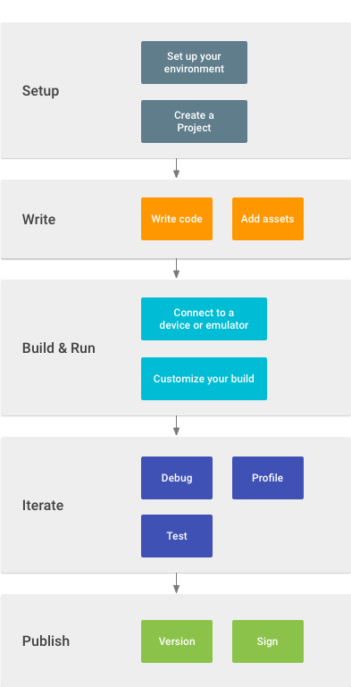

# 
 Récapitulant les conditions et le cadre du projet

Editeur: Yuxin SHI

## L'environnement de développement
- L'outil de développement: Android Studio 2.3
- La machine de test: NEXUS 6 Motorola, la version d'OS est android 6.0.
- Build outils: Gradle
- Bibliothèque extern:

## Récapitulation de l'application
- Nom d'application: ESIPIVIE
- Version fonctionne d'android plus bas: 4.3.0
- Version d'application: 1.0
- Taille:
- Langue: FR, EN, ZH
- Développeur: Yuxin SHI
- Contacts: syx1026@gmail.com

## Workflow

## Test
Le projet va être testé en deux parties. Une partie ne concerne pas le package android, et la partie d'android.

### Tests unitaires locals
Ce test fonctionne quand il n'y a pas de dépendence d'android. Les codes de tests se trouvent dans `/src/test/java`. L'outil de test est Jmockito.

### Tests de machine
Cette partie concerne la partie d'android qui se trouve dans `/src/androidTest/java`.

>https://developer.android.com/studio/test/index.html#_5
>
## Release
### Version de release
### Publier l'application
Il existe plusieur façon de publier une application. Selon developer.android.com, ceci les methodes:
- Google Play
- Par email interne
- Par site de l'école

Google Play face à public, mais cette application est visé sur les étudiants d'ESIPE et les professeurs d'ESIPE, donc on le publie par email ou par site de l'école m'appareil mieux.
