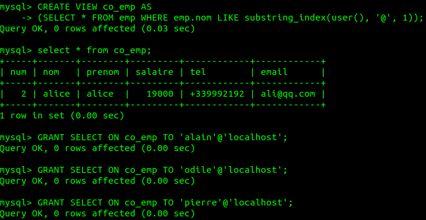
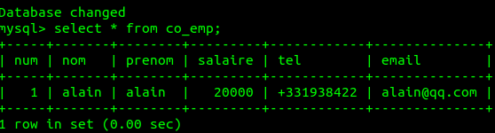
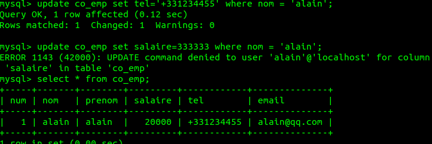
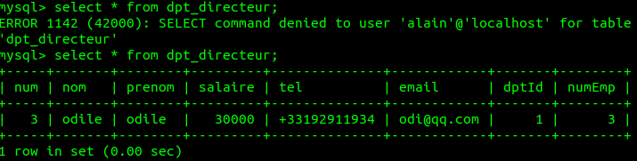
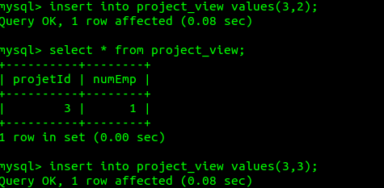
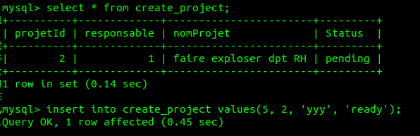
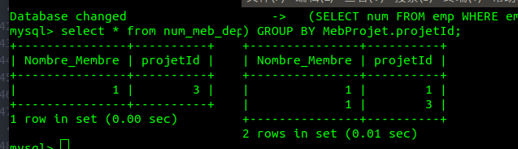
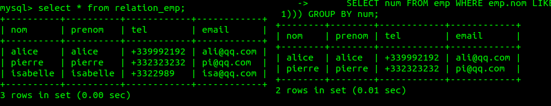
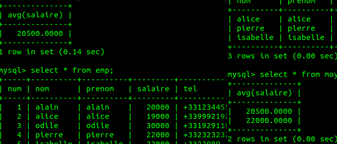

`Editor: Yuxin SHI 18/03/2018`
`[TD2 exercices3]`
# Compte Rendue EXO3
## Create tables
```sql
CREATE TABLE emp(
  num           int,
  nom           varchar(50),
  prenom        varchar(50),
  salaire       decimal(6,0),
  tel           varchar(12),
  email         varchar(50),
  primary key(num)
);
INSERT INTO emp VALUES(1, 'alain','alain', 20000, '+331938422', 'alain@qq.com');
INSERT INTO emp VALUES(2,'alice', 'alice',19000, '+339992192', 'ali@qq.com' );
INSERT INTO emp VALUES(3,'odile', 'odile', 30000, '+33192911934', 'odi@qq.com');
INSERT INTO emp VALUES(4, 'pierre','pierre', 22000, '+332323232', 'pi@qq.com');
INSERT INTO emp VALUES(5, 'isabelle','isabelle', 22000, '+3322989', 'isa@qq.com');

CREATE TABLE dpt(
  dptId         int auto_increment,
  nom           varchar(50),
  directeur     int,
  primary key(dptId),
  foreign key (directeur) references emp(num)
);
INSERT INTO dpt(nom, directeur) VALUES('informatique', 1);
INSERT INTO dpt(nom, directeur) VALUES('RH', 2);
INSERT INTO dpt(nom, directeur) VALUES ('compta', 4);


CREATE TABLE projet(
  projetId          int auto_increment,
  responsable       int,
  nomProjet         varchar(50),
  Status            enum('ready', 'pending', 'finish'),
  primary key(projetId),
  foreign key(responsable) references emp(num)
);

INSERT INTO projet(responsable, nomProjet, Status) VALUES(3, 'faire exploser dpt informatique','ready');
INSERT INTO projet(responsable, nomProjet, Status) VALUES(1,'faire exploser dpt RH','pending');
INSERT INTO projet(responsable, nomProjet, Status) VALUES(5,'faire exploser dpt marketing','finish');

CREATE TABLE EmpDpt(
  dptId       int,
  numEmp      int,
  foreign key(dptId) references dpt(dptId),
  foreign key(numEmp) references emp(num)
);
INSERT INTO EmpDpt VALUES(1, 3);
INSERT INTO EmpDpt VALUES(3, 5);
INSERT INTO EmpDpt VALUES(2, 4);
INSERT INTO EmpDpt VALUES(1, 1);
INSERT INTO EmpDpt VALUES(2, 2);
INSERT INTO EmpDpt VALUES(3, 4);

CREATE TABLE MebProjet(
  projetId        int,
  numEmp          int,
  foreign key(projetId) references projet(projetId),
  foreign key(numEmp) references emp(num)
);
INSERT INTO MebProjet VALUES(1, 2);
INSERT INTO MebProjet VALUES(1, 3);
INSERT INTO MebProjet VALUES(2, 4);
INSERT INTO MebProjet VALUES(3, 1);

/*Alice is still the admin of this database*/
USE tp2exo3;
/*if no this cmd, alice can not visit the database*/
GRANT ALL privileges ON tp2ex3 TO 'alice'@'localhost' WITH GRANT OPTION;
GRANT ALL privileges ON tp2ex3.* TO 'alice'@'localhost' WITH GRANT OPTION;
```
1. Un employé peut accéder à ses données personnelles enregistrées dans la relation Employé.
```sql
/*Login with Alice*/
CREATE VIEW co_emp AS
(SELECT * FROM emp WHERE emp.nom LIKE substring_index(user(), '@', 1));
GRANT SELECT ON co_emp TO 'alain'@'localhost';
GRANT SELECT ON co_emp TO 'odile'@'localhost';
GRANT SELECT ON co_emp TO 'pierre'@'localhost';
GRANT SELECT ON co_emp TO 'isabelle'@'localhost';
```
Effet:

Se logger avec alain:


2. Un employé peut modifier son numéro de téléphone ainsi que son email.
```SQL
GRANT SELECT, UPDATE(tel, email) ON co_emp TO 'alain'@'localhost';
GRANT SELECT, UPDATE(tel, email) ON co_emp TO 'odile'@'localhost';
...
```


3. Un directeur peut modifier les salaires de tous les employés de son département sauf le sien.

  ```sql
CREATE VIEW dpt_directeur AS
(SELECT * FROM emp INNER JOIN EmpDpt ON emp.num = EmpDpt.numEmp WHERE EmpDpt.dptId IN (SELECT dptId FROM EmpDpt INNER JOIN emp ON
  emp.num = EmpDpt.numEmp WHERE num = (SELECT num FROM emp WHERE emp.nom LIKE substring_index(user(), '@', 1))) AND emp.num != (SELECT num FROM emp WHERE emp.nom LIKE substring_index(user(), '@', 1)));

  mysql> select prenom, dpt.nom  from emp inner join dpt on num = dpt.directeur ;
  +--------+--------------+
  | prenom | nom          |
  +--------+--------------+
  | alain  | informatique |
  | alice  | RH           |
  | pierre | compta       |
  +--------+--------------+
GRANT SELECT, UPDATE(salaire) ON dpt_directeur TO 'alain'@'localhost';
GRANT SELECT, UPDATE(salaire) ON dpt_directeur TO'pierre'@'localhost';
```
  Logging as Alain:
  
  **Il y a une clause, je ne sais pas comment faire la modification.**
4. Un responsable de projet peut ajouter ou supprimer des employés à un projet dont il est responsable.
```sql
CREATE VIEW project_view AS
(SELECT * FROM MebProjet WHERE MebProjet.numEmp IN
  (SELECT num FROM emp WHERE emp.nom LIKE substring_index(user(), '@', 1)));
GRANT SELECT, UPDATE, DELETE, INSERT ON project_view TO 'alain'@'localhost';
```
Logging as Alain:


5. Un responsable de projet peut créer un nouveau projet.
  ```sql
  CREATE VIEW create_project AS
  (SELECT projetId,responsable,nomProjet,Status FROM projet WHERE responsable IN (
  SELECT num FROM emp WHERE emp.nom LIKE substring_index(user(), '@', 1)));
  GRANT SELECT, INSERT ON create_project TO 'alain'@'localhost';
  GRANT ....
  ```
Logging as Alain:


6. Le directeur d’un département peut connaître le nombre d’employés de son département assignés à chaque projet.
  ```sql
  CREATE VIEW num_meb_deptProject AS
  (SELECT count(MebProjet.numEmp) as Nombre_Membre, MebProjet.projetId
    FROM MebProjet INNER JOIN EmpDpt ON
    MebProjet.numEmp = EmpDpt.numEmp WHERE EmpDpt.numEmp IN
  (SELECT num FROM emp WHERE emp.nom LIKE substring_index(user(), '@', 1)) GROUP BY MebProjet.projetId);

  GRANT SELECT ON num_meb_deptProject TO 'alain'@'localhost';
  GRANT ... to others directors;
  ```
  Le résultat: à gauche = alain; à droite = alice


7. Un employé peut accéder aux informations des autres employés de son département à l’exception du salaire.
  ```sql
  CREATE VIEW relation_emp AS
  (SELECT nom, prenom, tel, email FROM emp INNER JOIN EmpDpt
    ON emp.num = EmpDpt.numEmp WHERE dptId IN
  (SELECT dptId FROM EmpDpt INNER JOIN emp ON emp.num = EmpDpt.numEmp
    WHERE EmpDpt.numEmp IN (
      SELECT num FROM emp WHERE emp.nom LIKE substring_index(user(), '@', 1))) GROUP BY num);

  GRANT SELECT ON relation_emp TO 'alain'@'localhost';
  GRANT SELECT ON relation_emp TO 'pierre'@'localhost';
  etc..
  ```
  A gauche est Pierre, il appartient a la fois RH et compta.
  A droite est Alice, elle appartien a RH.
  


8. Un employé peut connaître la moyenne des salaires de chaque département.
  ```sql
  CREATE VIEW moyenne_sal AS
  (SELECT avg(salaire) FROM emp INNER JOIN EmpDpt
    ON emp.num = EmpDpt.numEmp
    WHERE dptId IN (SELECT dptId FROM EmpDpt INNER JOIN emp
    ON emp.num = EmpDpt.numEmp WHERE EmpDpt.numEmp IN (
       SELECT num FROM emp WHERE emp.nom LIKE substring_index(user(), '@', 1))) GROUP BY dptId);
  GRANT SELECT ON moyenne_sal TO 'alain'@'localhost';
  GRANT SELECT ON moyenne_sal TO 'pierre'@'localhost';
  ....
  ```
  A droite est Pierre, il appartient a la fois RH et compta.
  Son salaire moyenne dans RH = (salaire d'Alice + salaire de Pierre)/2 = 20500.
  Et son salaire moyenne dans compta = (salaire de Pierre + salaire d'Isabelle)/2 = 22000.
  A gauche est Alice, elle appartien a RH, salaire moyenne = (salaire d'Alice + salaire de Pierre)/2 = 20500.
  


Les utilisateurs utilisent comme login leur numéro d’employé. En d’autres termes lorsque l’employé 123 est connecté la fonction USER() retourne la valeur 123@localhost.

**Après ça je ne comprend pas que peut-je faire. Masquer les utilisateurs par numéro de l'utilisateur en modifiant user()?**
