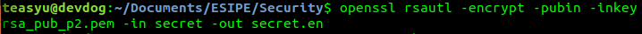
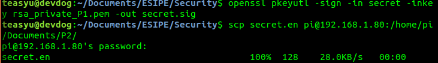
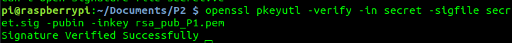
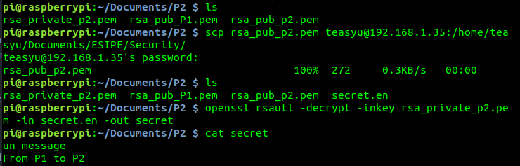

`Editor: Yuxin SHI`
`Date: 03/03/2018`
# TD1 Cryptographie
## EXO9
a. P1 va utiliser la clé publique de P2 pour garantir la confidentiation du message. Puis P1 va utiliser sa clé privée et signer le message, ainsi garantir son authenticité.
b. P2 va utiliser la clé publique de P1 pour vérifier c'est bien P1 qui l'envoyer quand il recevoit le message, pour lire le message, il va utiliser sa clé privée pour décrypter le message.

## EXO10
Dans cet exo, j'ai utilisé un raspberry pour jouer le rôle de P2.
Pour encrypter le message(P1):

Pour signer le fichier puis envoyer au P2:

Du côté p2:
Pour vérifier la signature:

Pour décrypter le message:

